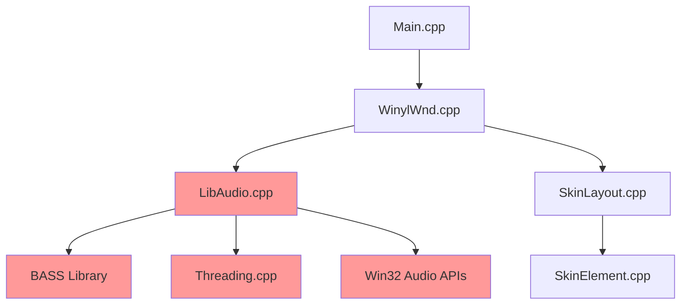

# Legacy Code Migration Plan

## Overview
This document outlines the detailed strategy for migrating Winyl's legacy codebase while preserving its core audio capabilities. The migration follows a **preservation-first** approach where audio functionality is never compromised.

## Migration Principles

### 1. Audio Engine Sanctity
- **NEVER modify core audio logic** until it's fully extracted and tested
- **ALL audio-related changes** must be validated with bit-perfect audio tests
- **PRESERVE threading model** for real-time audio processing
- **MAINTAIN BASS library integration** exactly as-is

### 2. Incremental Extraction
- Extract components in dependency order (leaves first, core last)
- Each extraction step must result in working software
- Maintain backward compatibility throughout migration
- Create clear rollback points at each stage

### 3. Risk Mitigation
- Comprehensive regression testing before each change
- Audio measurement validation with professional tools
- Multiple backup strategies and rollback procedures
- Conservative approach - preserve more than necessary initially

## Phase 1: Analysis and Mapping

### 1.1 Complete Code Audit
**Duration**: 2 weeks  
**Risk Level**: LOW

#### File Classification:
```cpp
// CRITICAL - Never modify until Phase 3
Files containing audio processing:
- LibAudio.cpp/h          // Core audio engine
- WinylWnd.cpp (audio methods) // Audio control integration
- Threading.cpp           // Audio threading
- Any BASS-related code   // Audio library integration

// HIGH RISK - Modify only after audio extraction
Files with audio dependencies:
- WinylWnd.cpp (non-audio) // Main window with mixed concerns
- DlgPageAudio.cpp        // Audio settings UI
- WindowEx.cpp            // Window base class with audio events

// SAFE TO MODIFY - No audio impact
Files for removal/replacement:
- Skin*.cpp               // Custom UI framework
- DlgPage*.cpp (non-audio)// Settings dialogs
- Language.cpp            // Localization system
- Associations*.cpp       // File associations
- LastFM.cpp             // Online services
```

#### Dependency Analysis:


### 1.2 Audio Data Flow Mapping
**Duration**: 1 week  
**Risk Level**: LOW

#### Current Audio Pipeline:
```cpp
// File Loading
WinylWnd::OnFileOpen() 
  → LibAudio::Open(file)
    → BASS_StreamCreateFile()
      → Audio decoding begins

// Playback Control  
WinylWnd::OnPlay()
  → LibAudio::Play()
    → BASS_ChannelPlay()
      → Audio output starts

// Real-time Processing
Audio callback thread (BASS internal)
  → LibAudio::FillBuffer()
    → BASS effects chain
      → ASIO/WASAPI output
```

#### Critical Interactions:
```cpp
// These connections MUST be preserved
class LibAudio {
    // Thread-safe audio control (CRITICAL)
    void Play();
    void Pause(); 
    void Stop();
    void SetPosition(double seconds);
    
    // Real-time audio processing (CRITICAL)
    void SetEqualizer(const EQSettings& settings);
    void SetEffects(const EffectChain& effects);
    
    // Output device management (CRITICAL)
    void SetOutputDevice(DeviceType type, int device_id);
    void SetBufferSize(int samples);
};
```

## Phase 2: Extraction Preparation

### 2.1 Create Isolation Layer
**Duration**: 2 weeks  
**Risk Level**: MEDIUM

#### Step 1: Audio Interface Definition
```cpp
// NEW: Pure interface for audio functionality
class IAudioEngine {
public:
    virtual ~IAudioEngine() = default;
    
    // Playback Control
    virtual bool LoadFile(const std::wstring& filepath) = 0;
    virtual bool Play() = 0;
    virtual bool Pause() = 0;
    virtual bool Stop() = 0;
    virtual bool Seek(double position_seconds) = 0;
    
    // Audio Information
    virtual double GetDuration() const = 0;
    virtual double GetPosition() const = 0;
    virtual AudioFormat GetFormat() const = 0;
    virtual bool IsPlaying() const = 0;
    
    // Device Management
    virtual std::vector<AudioDevice> GetOutputDevices() const = 0;
    virtual bool SetOutputDevice(const AudioDevice& device) = 0;
    virtual bool SetBufferSize(int samples) = 0;
    
    // Effects (preserve existing)
    virtual bool SetEqualizer(const EqualizerSettings& eq) = 0;
    virtual bool SetVolume(float volume) = 0;
    
    // NEW: Analysis data access
    virtual bool GetAnalysisData(AnalysisDataType type, void* buffer, size_t size) = 0;
    virtual void SetAnalysisEnabled(bool enabled) = 0;
};
```

#### Step 2: LibAudio Wrapper Implementation
```cpp
// NEW: Wrapper around existing LibAudio
class LibAudioWrapper : public IAudioEngine {
private:
    LibAudio* legacy_audio;  // Existing LibAudio instance
    
public:
    // Constructor takes existing LibAudio pointer
    LibAudioWrapper(LibAudio* audio) : legacy_audio(audio) {}
    
    // Delegate all calls to existing implementation
    bool LoadFile(const std::wstring& filepath) override {
        return legacy_audio->Open(filepath.c_str());
    }
    
    bool Play() override {
        return legacy_audio->Play();
    }
    
    // ... delegate all other methods
    
    // NEW: Analysis data extraction
    bool GetAnalysisData(AnalysisDataType type, void* buffer, size_t size) override {
        // NEW: Extract audio samples from BASS stream for analysis
        // This is the ONLY new functionality added to audio engine
        switch (type) {
            case AnalysisDataType::Samples:
                return ExtractSamplesForAnalysis(buffer, size);
            case AnalysisDataType::Spectrum:
                return ExtractSpectrumData(buffer, size);
        }
        return false;
    }
    
private:
    // NEW: Safe audio data extraction
    bool ExtractSamplesForAnalysis(void* buffer, size_t size) {
        // Use BASS_ChannelGetData with BASS_DATA_AVAILABLE flag
        // This is read-only and doesn't affect playback
        DWORD bytes_available = BASS_ChannelGetData(legacy_audio->GetChannel(), 
                                                   buffer, 
                                                   BASS_DATA_AVAILABLE);
        return bytes_available > 0;
    }
};
```

### 2.2 UI Dependency Isolation
**Duration**: 2 weeks  
**Risk Level**: LOW

#### Step 1: Remove Direct Audio Dependencies
```cpp
// BEFORE: WinylWnd directly calls LibAudio
class WinylWnd : public WindowEx {
    LibAudio libAudio;  // Direct dependency
    
    void OnPlay() {
        libAudio.Play();  // Direct call
    }
};

// AFTER: WinylWnd uses interface
class WinylWnd : public WindowEx {
    std::unique_ptr<IAudioEngine> audio_engine;
    
    void OnPlay() {
        audio_engine->Play();  // Interface call
    }
    
    // Dependency injection
    void SetAudioEngine(std::unique_ptr<IAudioEngine> engine) {
        audio_engine = std::move(engine);
    }
};
```

#### Step 2: Event System Decoupling
```cpp
// NEW: Audio event system
enum class AudioEvent {
    PlaybackStarted,
    PlaybackPaused,
    PlaybackStopped,
    TrackChanged,
    PositionChanged,
    VolumeChanged,
    DeviceChanged
};

class AudioEventBus {
public:
    using EventHandler = std::function<void(AudioEvent, const EventData&)>;
    
    void Subscribe(AudioEvent event, EventHandler handler);
    void Unsubscribe(AudioEvent event, EventHandler handler);
    void Publish(AudioEvent event, const EventData& data);
};

// Audio engine publishes events instead of direct callbacks
class LibAudioWrapper : public IAudioEngine {
    void OnPlaybackStarted() {
        event_bus->Publish(AudioEvent::PlaybackStarted, {});
    }
};

// UI subscribes to events instead of direct coupling
class WinylWnd : public WindowEx {
    void Initialize() {
        audio_events->Subscribe(AudioEvent::PlaybackStarted, 
                               [this](auto event, auto data) { 
                                   UpdatePlayButton(); 
                               });
    }
};
```

## Phase 3: Audio Engine Extraction

### 3.1 LibAudio Standalone Library
**Duration**: 3 weeks  
**Risk Level**: HIGH

#### Step 1: Minimal Extraction
```cpp
// NEW: Standalone LibAudio project
// File: LibAudio/LibAudio.vcxproj

// Extract these files EXACTLY as-is:
LibAudio/
├── LibAudio.cpp          // Main audio engine (EXACT COPY)
├── LibAudio.h            // Audio engine header (EXACT COPY)  
├── Threading.cpp         // Threading implementation (EXACT COPY)
├── Threading.h           // Threading header (EXACT COPY)
├── bass/                 // BASS library files (EXACT COPY)
│   ├── bass.h
│   ├── bass.lib
│   └── *.dll files
└── LibAudioExports.cpp   // NEW: C API exports

// NEW: C API for external access
extern "C" {
    // Opaque handle for C API
    typedef struct AudioEngine* AudioEngineHandle;
    
    // C API functions
    LIBAUDIO_API AudioEngineHandle LibAudio_Create();
    LIBAUDIO_API void LibAudio_Destroy(AudioEngineHandle handle);
    LIBAUDIO_API bool LibAudio_LoadFile(AudioEngineHandle handle, const wchar_t* filepath);
    LIBAUDIO_API bool LibAudio_Play(AudioEngineHandle handle);
    LIBAUDIO_API bool LibAudio_Pause(AudioEngineHandle handle);
    LIBAUDIO_API bool LibAudio_Stop(AudioEngineHandle handle);
    
    // NEW: Analysis data access
    LIBAUDIO_API bool LibAudio_GetSamples(AudioEngineHandle handle, 
                                         float* buffer, 
                                         int buffer_size,
                                         int* samples_read);
}
```

#### Step 2: Regression Testing
```cpp
// Comprehensive audio testing suite
class AudioRegressionTests {
public:
    void TestAllFormats() {
        // Test every supported format
        std::vector<std::string> test_files = {
            "test.flac", "test.mp3", "test.wav", "test.ogg",
            "test.m4a", "test.wma", "test.ape", "test.mpc"
        };
        
        for (const auto& file : test_files) {
            TestFilePlayback(file);
            TestSeekAccuracy(file);
            TestMetadataExtraction(file);
        }
    }
    
    void TestBitPerfectOutput() {
        // Generate known test signal
        AudioEngineHandle engine = LibAudio_Create();
        
        // Load sine wave test file
        LibAudio_LoadFile(engine, L"1kHz_sine_24bit_96kHz.flac");
        
        // Capture output with professional audio interface
        // Compare with expected bit-perfect output
        // ANY difference = test failure
        
        LibAudio_Destroy(engine);
    }
    
    void TestLatencyMeasurement() {
        // Measure round-trip latency
        // Must be within acceptable bounds for each output type
        MeasureASIOLatency();      // < 10ms typical
        MeasureWASAPILatency();    // < 50ms typical
        MeasureDirectSoundLatency(); // < 100ms acceptable
    }
};
```

### 3.2 Integration Validation
**Duration**: 1 week  
**Risk Level**: MEDIUM

#### Step 1: Side-by-Side Comparison
```cpp
// Run both versions simultaneously for comparison
class DualAudioTest {
    LibAudio* original_audio;           // Original implementation
    AudioEngineHandle extracted_audio;  // Extracted implementation
    
public:
    void ComparePlayback(const std::wstring& file) {
        // Load same file in both engines
        original_audio->Open(file.c_str());
        LibAudio_LoadFile(extracted_audio, file.c_str());
        
        // Start playback simultaneously
        original_audio->Play();
        LibAudio_Play(extracted_audio);
        
        // Compare audio output streams
        // Should be bit-identical
        CompareAudioStreams();
    }
    
private:
    void CompareAudioStreams() {
        // Use audio loopback to capture output from both engines
        // Compare sample-by-sample for differences
        // Log any discrepancies for analysis
    }
};
```

## Phase 4: UI Replacement

### 4.1 Minimal WebView2 Integration
**Duration**: 2 weeks  
**Risk Level**: LOW

#### Step 1: Basic WebView2 Host
```cpp
// NEW: WebView2 container window
class WebViewWindow : public IWebView2Host {
private:
    HWND window_handle;
    Microsoft::WRL::ComPtr<ICoreWebView2> webview;
    Microsoft::WRL::ComPtr<ICoreWebView2Environment> webview_environment;
    
public:
    bool Initialize(HWND parent) {
        // Create WebView2 environment
        auto options = Microsoft::WRL::Make<CoreWebView2EnvironmentOptions>();
        
        HRESULT hr = CreateCoreWebView2EnvironmentWithOptions(
            nullptr, nullptr, options.Get(),
            Callback<ICoreWebView2CreateCoreWebView2EnvironmentCompletedHandler>(
                [this](HRESULT result, ICoreWebView2Environment* env) -> HRESULT {
                    webview_environment = env;
                    return CreateWebViewWindow();
                }).Get());
                
        return SUCCEEDED(hr);
    }
    
private:
    HRESULT CreateWebViewWindow() {
        return webview_environment->CreateCoreWebView2Controller(
            window_handle,
            Callback<ICoreWebView2CreateCoreWebView2ControllerCompletedHandler>(
                [this](HRESULT result, ICoreWebView2Controller* controller) -> HRESULT {
                    if (SUCCEEDED(result)) {
                        controller->get_CoreWebView2(&webview);
                        SetupWebViewCallbacks();
                        NavigateToApp();
                    }
                    return S_OK;
                }).Get());
    }
    
    void SetupWebViewCallbacks() {
        // Set up JavaScript bridge
        webview->AddWebResourceRequestedFilter(L"*", COREWEBVIEW2_WEB_RESOURCE_CONTEXT_ALL);
        webview->add_WebResourceRequested(/* ... */);
        
        // Set up message handling
        webview->add_WebMessageReceived(/* ... */);
    }
    
    void NavigateToApp() {
        // Load minimal HTML application
        webview->NavigateToString(GetMinimalAppHTML());
    }
};
```

#### Step 2: Basic Audio Control UI
```html
<!-- Minimal functional UI -->
<!DOCTYPE html>
<html>
<head>
    <title>Winyl Analysis Edition</title>
    <style>
        body { 
            font-family: 'Segoe UI', Tahoma, Geneva, Verdana, sans-serif;
            margin: 0; padding: 20px; 
            background: #1e1e1e; color: #ffffff;
        }
        .transport-controls button {
            background: #333; color: white; border: none;
            padding: 10px 20px; margin: 5px; cursor: pointer;
        }
        .transport-controls button:hover { background: #555; }
        .file-info { margin: 20px 0; }
        .drag-drop-area {
            border: 2px dashed #666; padding: 40px; text-align: center;
            margin: 20px 0; cursor: pointer;
        }
        .drag-drop-area:hover { border-color: #999; }
    </style>
</head>
<body>
    <h1>Winyl Analysis Edition</h1>
    
    <div class="drag-drop-area" id="dropArea">
        Drop audio files here or click to browse
    </div>
    
    <div class="file-info" id="fileInfo">
        No file loaded
    </div>
    
    <div class="transport-controls">
        <button id="playBtn">▶️ Play</button>
        <button id="pauseBtn">⏸️ Pause</button>
        <button id="stopBtn">⏹️ Stop</button>
    </div>
    
    <script>
        // Minimal JavaScript for testing
        class WinylApp {
            constructor() {
                this.initializeUI();
            }
            
            initializeUI() {
                document.getElementById('playBtn').onclick = () => this.play();
                document.getElementById('pauseBtn').onclick = () => this.pause();
                document.getElementById('stopBtn').onclick = () => this.stop();
                
                this.setupDragDrop();
            }
            
            async play() {
                if (window.chrome?.webview?.hostObjects?.winyl) {
                    await window.chrome.webview.hostObjects.winyl.Play();
                }
            }
            
            async pause() {
                if (window.chrome?.webview?.hostObjects?.winyl) {
                    await window.chrome.webview.hostObjects.winyl.Pause();
                }
            }
            
            async stop() {
                if (window.chrome?.webview?.hostObjects?.winyl) {
                    await window.chrome.webview.hostObjects.winyl.Stop();
                }
            }
            
            setupDragDrop() {
                const dropArea = document.getElementById('dropArea');
                
                dropArea.ondragover = (e) => { e.preventDefault(); };
                dropArea.ondrop = async (e) => {
                    e.preventDefault();
                    const files = e.dataTransfer.files;
                    if (files.length > 0) {
                        await this.loadFile(files[0].path);
                    }
                };
            }
            
            async loadFile(filePath) {
                if (window.chrome?.webview?.hostObjects?.winyl) {
                    const success = await window.chrome.webview.hostObjects.winyl.LoadFile(filePath);
                    if (success) {
                        document.getElementById('fileInfo').textContent = `Loaded: ${filePath}`;
                    }
                }
            }
        }
        
        // Initialize when page loads
        document.addEventListener('DOMContentLoaded', () => {
            new WinylApp();
        });
    </script>
</body>
</html>
```

## Phase 5: Migration Completion

### 5.1 Legacy Code Removal
**Duration**: 1 week  
**Risk Level**: LOW

#### Files to Remove:
```cpp
// Custom UI framework (safe to delete)
DELETE: Skin*.cpp/h           // Custom skinning system
DELETE: DlgPage*.cpp/h        // Settings dialogs  
DELETE: Language.cpp/h        // Localization
DELETE: Associations*.cpp/h   // File associations
DELETE: LastFM.cpp/h         // Online services

// Keep only essential files:
KEEP: Main.cpp               // Application entry point (modify)
KEEP: LibAudio.*             // Audio engine (extracted)
KEEP: Threading.*            // Audio threading (extracted)
KEEP: WindowEx.*             // Base window class (simplify)
```

### 5.2 Final Integration
**Duration**: 1 week  
**Risk Level**: LOW

#### Simplified Main.cpp:
```cpp
// NEW: Simplified application entry point
int APIENTRY _tWinMain(HINSTANCE hInstance, HINSTANCE hPrevInstance, 
                       LPTSTR lpCmdLine, int nCmdShow) {
    // Initialize COM for WebView2
    CoInitializeEx(nullptr, COINIT_APARTMENTTHREADED);
    
    // Create audio engine
    auto audio_engine = std::make_unique<LibAudioWrapper>();
    
    // Create main window with WebView2
    auto main_window = std::make_unique<WebViewMainWindow>();
    main_window->SetAudioEngine(std::move(audio_engine));
    main_window->Initialize(hInstance);
    
    // Message loop
    MSG msg;
    while (GetMessage(&msg, nullptr, 0, 0)) {
        TranslateMessage(&msg);
        DispatchMessage(&msg);
    }
    
    CoUninitialize();
    return 0;
}
```

## Risk Management

### Critical Checkpoints:
1. **After Phase 2**: Original Winyl still works exactly as before
2. **After Phase 3**: Extracted audio engine passes all regression tests
3. **After Phase 4**: New UI can control audio without any quality loss
4. **After Phase 5**: Migration complete with full feature parity

### Rollback Procedures:
- **Git branches** for each phase with working checkpoints
- **Automated testing** before each phase progression
- **Audio measurement** validation at each step
- **User acceptance testing** with audiophile community

### Success Criteria:
- [ ] All audio formats play identically to original
- [ ] Bit-perfect output verified with measurement tools
- [ ] No increase in latency or CPU usage
- [ ] All ASIO/WASAPI functionality preserved
- [ ] Smooth transition with no user data loss

---

**Document Version**: 1.0  
**Last Updated**: 2024-01-20  
**Critical Review**: Required before Phase 3 begins  
**Approval Required**: Technical Lead + Audio Expert